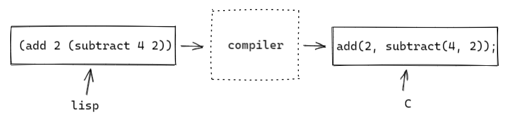
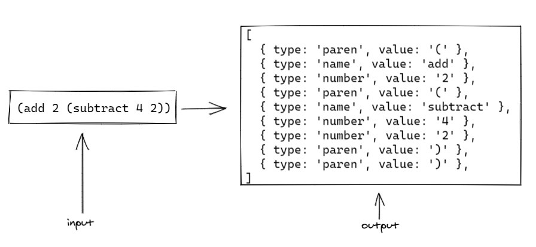
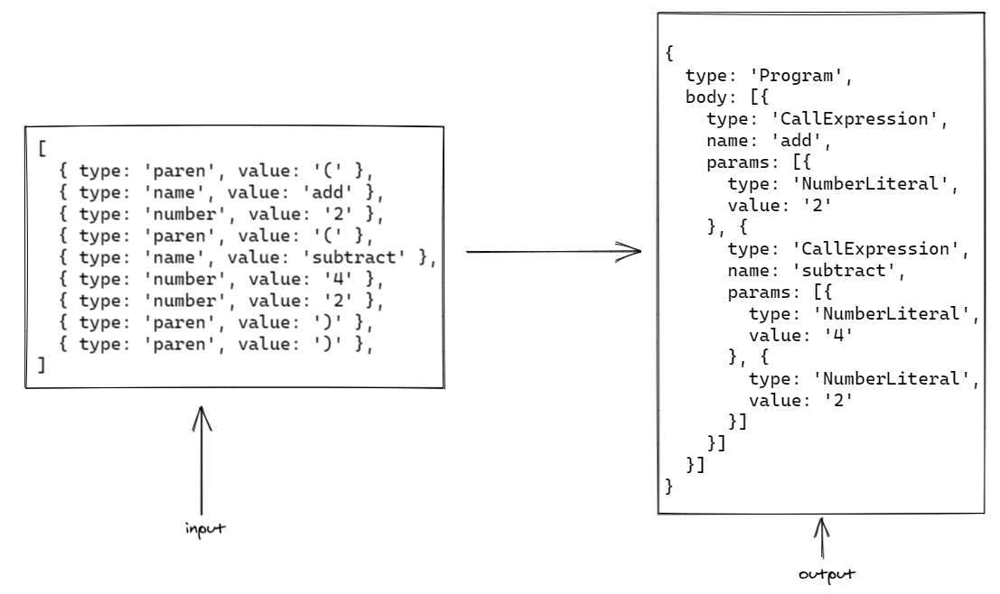
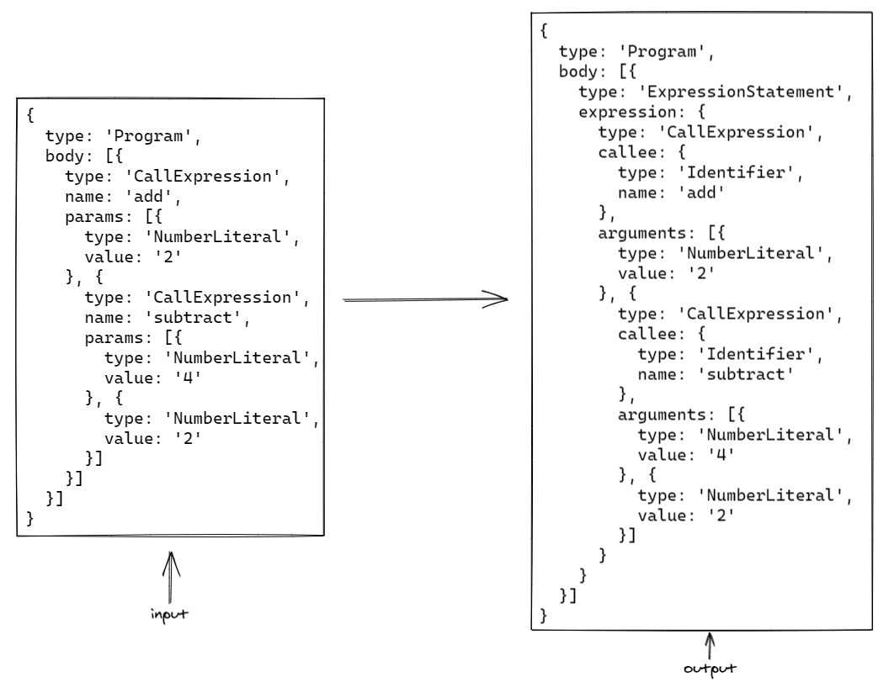
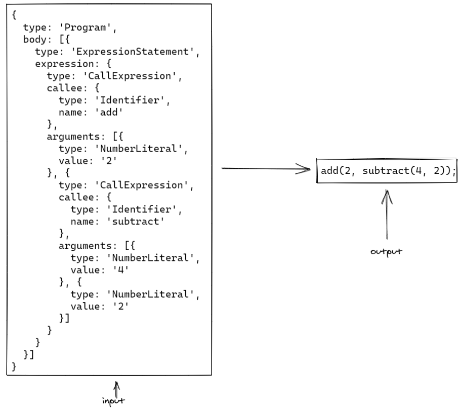
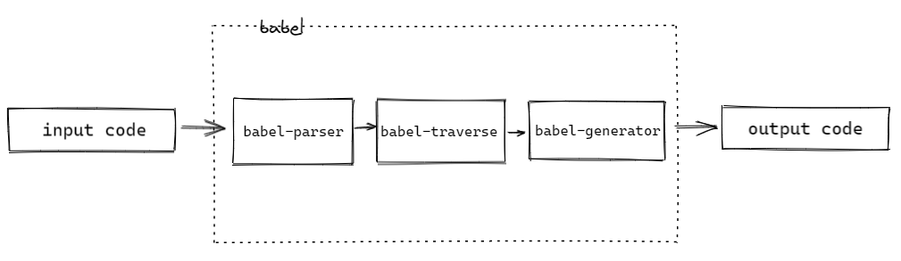

### babel 是什么？

babel 是一个编译器


从宏观上来说，编译器的编译过程一般分为三步

1. parsing 将原始代码解析为抽象语法树（ast）
2. transforming 变换第一步的 ast，得到新的 ast
3. generating（也可称为 printing） 遍历新的 ast，生成目标代码

其中 parsing 又分为两步

1. 词法分析，也就是将原始代码拆分成一个个的 token（用于描述最小独立语法单元的对象）
2. 语法分析，递归遍历 tokens 数组，构建 ast

#### 举个栗子

上面的描述可能稍微有点抽象，下面我们通过一个实际的例子来讲述这三个步骤的输入输出。



比如说我们想把左边的 lisp 代码转换为右边的 c 代码，我们来一起看看每一步的输入和输出长什么样子（内容基本来自 [the-super-tiny-compiler](https://github.com/jamiebuilds/the-super-tiny-compiler) 强烈推荐自己对着实现一遍，代码不多，去掉注释才 200 多行，注释非常详细，很好懂）。

##### 1.1 词法分析



##### 1.2 语法分析



> 想了解我们平常写的 js 代码会被 babel 转为怎样的 ast 可以查看如下网站 [astexplorer](https://astexplorer.net/)

##### 2 ast 变换（transforming）



对于我们这个简单的例子而言，ast 不做变换我们也能直接生成目标代码，这里仅处于演示目的，我们能对 ast 节点进行增删改操作生成一棵我们预期的 ast 树。

##### 3 生成目标代码（generating）



通过上面的例子我们对于编译器是如何将源代码编译成目标代码的过程是不是更加清晰了呢？理解了上面的过程我们再来看看 babel 是怎么将这些过程组织起来的。



如上图所示，`babel-parser` 负责将输入代码转为 ast，`babel-traverse`负责提供深度遍历 ast 节点的能力（traverse 本身并不负责转换 ast，只是提供遍历 ast 节点的能力，具体的转换逻辑交给各种 babel 插件来实现，这也在很大程度上提高了 babel 的扩展性，日后如果新增了语言特性不用修改或很少修改核心代码，只需要编写相应的插件来转换新的语法就行了，比如说我们常见的 `@babel/plugin-transform-arrow-functions` 就是用来转换箭头函数的），`babel-generator` 负责根据新的 ast 打印出目标代码。

### 核心概念

#### 插件

babel 初始情况不会对代码做任何转换，babel 的工作流程如下所示

`code => babel => code`

既然 babel 初始情况下不转换代码，那我们平常写的 es6 代码是如何变成 es5 的呢？答案就是插件，借助 babel-traverse，插件可以遍历 ast 节点并进行增删改操作，进而实现代码转换功能。之所以采用插件架构应该是考虑到功能拆分、方便扩展和维护吧。

#### preset

插件本身的粒度非常细，细到可能每一个语法都会有独立的插件来做转换，比如说 es6 中常见的箭头函数就是由 `@babel/plugin-transform-arrow-functions` 来进行转换的，如果这么多的插件都需要我们手动引入并配置的话那其实是挺麻烦的，所以 babel 抽象出了 preset 来管理一系列插件，这对于使用者来说是更为友好的，通常情况下我们只需要使用 `@babel/preset-env` 就可以了。

### 核心包

#### @babel-core

包含 @babel/parser, @babel/traverse, @babel/generator，其中 parser 负责将源代码解析成 ast，traverse 向外提供遍历 ast 节点的能力，generator 负责根据变换后的 ast 生成目标代码。

#### @babel/cli

提供在命令行中调用 @babel/core 的能力。

#### @babel/runtime & @babel/plugin-transform-runtime

babel 在转换代码的过程中会在模块顶部插入一些帮助函数，举个例子：

```js
class A {}
```

上面的代码在经过 babel 编译之后可能（取决于我们要支持的环境）会变成如下代码

```js
'use strict';

function _classCallCheck(instance, Constructor) {
  if (!(instance instanceof Constructor)) {
    throw new TypeError('Cannot call a class as a function');
  }
}

var A = function A() {
  _classCallCheck(this, A);
};
```

这里的 `_classCallCheck` 被称为帮助函数，默认情况下 babel 会将帮助函数直接打入目标文件中，就像我们这里一样，如果我们的代码有很多模块，那这种将帮助函数直接打入目标文件的做法无疑会在一定程度上导致输出代码体积增大，更好的方式可能是采取引入的方式。这里的@babel/runtime 和 @babel/plugin-transform-runtime 就是来干这件事情的。具体使用如下：

1. 安装依赖

```sh
# @babel/runtime中包含各种帮助函数，是代码运行的时候需要用到的，
# 我们这里当做生产依赖引入
npm i @babel/runtime;
```

```sh
npm i -D @babel/plugin-transform-runtime
```

2. 配置 `babel.config.js`

```js
const config = {
  // 其他配置
  plugins: ['@babel/plugin-transform-runtime'],
};
module.exports = config;
```

经过 transform 的代码如下所示

```js
'use strict';

var _interopRequireDefault = require('@babel/runtime/helpers/interopRequireDefault');

var _classCallCheck2 = _interopRequireDefault(
  require('@babel/runtime/helpers/classCallCheck'),
);

var A = function A() {
  (0, _classCallCheck2.default)(this, A);
};
```

可以看到 `_classCallCheck2` 已经变成从 `@babel/runtime` 中引入了

### 参考资料

[解剖 Babel —— 向前端架构师迈出一小步](https://mp.weixin.qq.com/s/hgiSKyFxb6RFD6n2diixvQ)
[the-super-tiny-compiler](https://github.com/jamiebuilds/the-super-tiny-compiler)（了解编译器工作原理非常好的材料，去掉注释后的代码才 200 多行，强烈推荐自己实现一遍）
