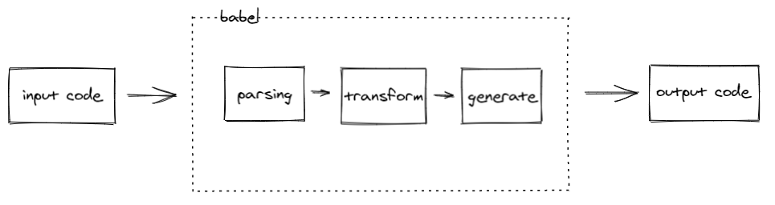

### babel 是什么？

babel 是一个编译器

从宏观上来说，编译器的编译过程一般分为三步

1. parsing 将原始代码解析为抽象语法树（ast）
2. transforming 变换第一步的 ast，得到新的 ast
3. generating（也可称为 printing） 遍历新的 ast，生成目标代码

其中 parsing 又分为两步

1. 词法分析，也就是将原始代码拆分成一个个的 token（用于描述最小独立语法单元的对象）
2. 语法分析，递归遍历 tokens 数组，构建 ast

#### 举个栗子

上面的描述可能稍微有点抽象，下面我们通过一个实际的例子来讲述这三个步骤的输入输出。

比如说我们想把左边的 lisp 代码转换为右边的 c 代码，我们来一起看看每一步的输入和输出长什么样子（内容基本来自 [the-super-tiny-compiler](https://github.com/jamiebuilds/the-super-tiny-compiler) 强烈推荐自己对着实现一遍，代码不多，去掉注释才 200 多行，注释非常详细，很好懂）。

##### 1.1 词法分析

##### 1.2 语法分析

> 想了解我们平常写的 js 代码会被 babel 转为怎样的 ast 可以查看如下网站 [astexplorer](https://astexplorer.net/)

##### 2 ast 变换（transforming）

对于我们这个简单的例子而言，ast 不做变换我们也能直接生成目标代码，这里仅处于演示目的，我们能对 ast 节点进行增删改操作生成一棵我们预期的 ast 树。

##### 3 生成目标代码（generating）

通过上面的例子我们对于编译器是如何将源代码编译成目标代码的过程是不是更加清晰了呢？理解了上面的过程我们再来看看 babel 是怎么将这些过程组织起来的。

如上图所示，`babel-parser` 负责将输入代码转为 ast，`babel-traverse`负责提供深度遍历 ast 节点的能力（traverse 本身并不负责转换 ast，只是提供遍历 ast 节点的能力，具体的转换逻辑交给各种 babel 插件来实现，这也在很大程度上提高了 babel 的扩展性，日后如果新增了语言特性不用修改或很少修改核心代码，只需要编写相应的插件来转换新的语法就行了，比如说我们常见的 `@babel/plugin-transform-arrow-functions` 就是用来转换箭头函数的），`babel-generator` 负责根据新的 ast 打印出目标代码。

### 参考资料

[解剖 Babel —— 向前端架构师迈出一小步](https://mp.weixin.qq.com/s/hgiSKyFxb6RFD6n2diixvQ)
[the-super-tiny-compiler](https://github.com/jamiebuilds/the-super-tiny-compiler)（了解编译器工作原理非常好的材料，去掉注释后的代码才 200 多行，强烈推荐自己实现一遍）
