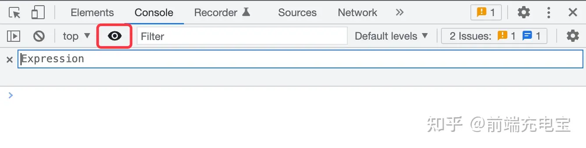

# chrome dev tools 使用技巧

## dom 断点调试

当你要调试特定元素的 DOM 中的更改时，可以使用此选项。这些是 DOM 更改断点的类型：

- Subtree modifications: 子节点删除或添加时
- Attributes modifications: 属性修改时
- Node Removal: 节点删除时

## logpoints

Logpoints （日志点）是一种向控制台提供调试信息的方式，而无需使用 console.log()，这在线上应用调试时会很有用。可以通过右键单击 DevTools 中的 Source 选项卡中的任何行并指定要记录的表达式来添加新的 Logpoint。执行该行时，就会在控制台中获得它的值。

## 动态表达式

实时表达式是一种在表达式更改时显示其值的功能。 这有助于追踪代价高昂的表达式（如动画中使用的表达式）或变化很大的表达式（例如，如果正在遍历数组）的问题。它会将 Console 面板里的表达式置顶，并且能随着用户点击的变化，而动态刷新该置顶的表达式。

只需点击下图中眼睛图标，输入一个想要置顶的 JavaScript 表达式即可：

## 复制 JavaScript 变量

假如你的代码经过计算会输出一个复杂的对象，且需要被复制下来发送给其他人，怎么办？
使用 copy 函数，将对象作为入参执行即可

## 截取一张全屏的网页

偶尔咱们也会有对网页截屏的需求，一屏还好，系统自带的截屏或者微信截图等都可以办到，但是要求将超出一屏的内容也截下来咋办呢？

- 准备好需要截屏的内容
- cmd + shift + p 执行 Command 命令
- 输入 Capture full size screenshot 按下回车

注意：目前对于 juejin 网站使用 Capture full size screenshot 无法正常截取全屏

## 在控制台中使用上次操作的值 🎃

使用\$\_可以引用在控制台执行的前一步操作的返回值。如果您正在控制台调试一些 JavaScript 代码，并且需要引用先前的返回值，那么这可能非常方便。

## 编辑页面上的任何文本 ✍

在控制台输入 document.body.contentEditable="true"或者 document.designMode = 'on'就可以实现对网页的编辑了。

其实这个还是比较实用的，比如你要测试一个 DOM 节点文字太长时，样式是否会混乱，或者要去直接修改页面元素去满足一些业务需求时。（我之前是在 Elements 面板一个一个去修改的，，，）

## 全局搜索

有时候我们想在页面中找一些标识符，又不知道标识符在哪个文件里面，这时候全局搜索就非常好用了。

## 媒体查询

媒体查询是自适应网页设计的基本部分。在 Chrome Devtools 中的设备模式下，在三圆点菜单中点击 Show Media queries 即可启用：（或者直接在命令中输入 show media queries/hide media queries）

如何使用：

- 点击某个顶部某个条形展示该尺寸下的页面
- 右键某个条形可查看样式源码定义

## 调试伪类样式

有一些样式比如说 focus,hover 等只有在鼠标点击或者经过的时候才会展示，而等我们打开调试工具想调试样式的时候又消失了，这时候可以点击 :hov 然后勾选相应的伪类来进行调试。

## 快速编辑元素样式

有时候我们想给某个 dom 元素快速加上或者删除某个特定样式，双击并编辑 dom 元素上的样式属性固然可行，但是在样式面板上直接单击 :cls 后进行编辑可能会更方便

## 参考

- [devtoolstips](https://devtoolstips.org/)
