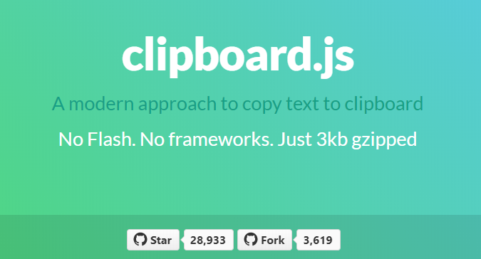
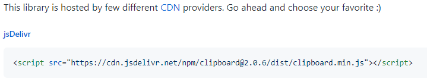
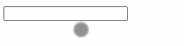
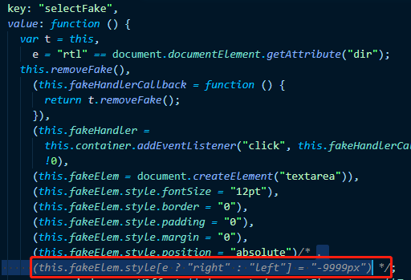
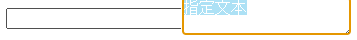
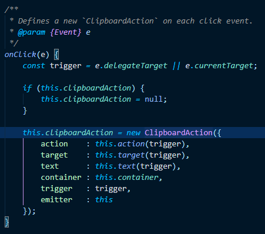

[toc]


### 背景

最近为了给抖音号导流需要实现个用户在 h5 页面上任何地方点击都复制一段文本到用户的剪贴板中（等用户打开抖音 app 的时候剪贴板中有这段文本就会跳转到指定的抖音号页面）。虽说有点流氓~

### clipboard 使用简介

具体介绍及 api 可参考 [clipboard](https://clipboardjs.com/)

```ts
// 先引入Clipboard，如果是在ts中使用的话需要同时安装clipboard和@types/clipboard
import Clipboard from "clipboard";

// 用户点击页面时，往用户剪切板存放指定文本
const clipboard = new Clipboard("body", {
  text() {
    // 指定文本需要替换为实际文本
    return "指定文本";
  },
});
// 复制成功或失败后都注销clipboard对象
clipboard.on("success", function () {
  clipboard.destroy();
});
clipboard.on("error", function () {
  clipboard.destroy();
});
```

### input 元素无法聚焦

#### 问题重现

- 从[CDN-Providers](https://github.com/zenorocha/clipboard.js/wiki/CDN-Providers)下载 clipboard.js 文件
  

- 将下载的 js 通过 script 引入页面

```html
<!DOCTYPE html>
<html lang="en">
  <head>
    <meta charset="UTF-8" />
    <meta
      name="viewport"
      content="width=device-width,initial-scale=1.0,minimum-scale=1.0,maximum-scale=1.0,user-scalable=0"
    />
    <title>Document</title>
    <script>
      // 下载的clipboard文件放这里
    </script>
  </head>
  <body>
    <input type="text" />
    <script>
      const clipboard = new ClipboardJS("body", {
        text() {
          return "指定文本";
        },
      });
    </script>
  </body>
</html>
```

- 在页面上点击 input，可以看到 input 确实没法获取焦点
  

#### 排查原因

- 在上面的 clipboard 文件中找到以下代码并注释掉
  

- 打开页面再次点击 input
  可以看到我们点击 input 后右边出现一个 textarea，里面的内容正是我们设置的内容，可以猜测 clipboard 应该是在点击的时候创建了个隐藏的 textarea，textarea 里面的内容就是我们要复制的内容，然后调用 `document.execCommand('copy')`复制 textarea 里面的内容。具体实现逻辑可翻一下源代码查看，这里就不再赘述了
  

#### 解决方案

既然问题已经找到了，那解决方案就比较好处理了，最简单的方式就是阻止 input 元素上的事件冒泡到 body（我们前面指定了 body 作为 clipboard 的初始化 selector）上，但对于页面上有很多 input 元素而且这些元素分布在不同页面，这种修改方式就不那么优雅了。

下面介绍下我的解决方案

- 通过阅读源码找到 clipboard 里面是怎么绑定 click 事件的
  ClipboardAction 里面处理了创建隐藏 textarea 并执行复制的逻辑
  

- 然后我们在项目里重写下 Clipboard 构造函数下的 onClick 方法
  其实就是把原来的方法存起来，然后判断当前 click 事件的触发元素，如果是 input 就不初始化 ClipboardAction 类（核心逻辑是 rewriteClipboard 方法）

```ts
import Clipboard from "clipboard";

// 用户点击页面时，往用户剪切板存放指定文本
const clipboard = new Clipboard("body", {
  text() {
    // 指定文本需要替换为实际文本
    return "指定文本";
  },
});
rewriteClipboard(clipboard);

// input元素复制会报错，且在input元素上复制会导致input元素失去焦点，
// 这里重写下clipboard原型的onClick方法，如果是input元素就什么都不做
function rewriteClipboard(clipboard: Clipboard) {
  const { constructor } = clipboard;
  const proto: Record<string, any> = constructor.prototype;
  const original = proto.onClick;

  proto.onClick = function (e: MouseEvent) {
    const ele = e.target as HTMLElement;
    if (ele && /input/i.test(ele.tagName)) {
      return;
    }
    original.call(clipboard, e);
  };
}
```

### 其他

当然，有人可能不太推荐修改原型这种方式。还有其他方案可以选择：

- 给作者提 pr（最优雅的方式，但是作者不一定会改，而且改动周期也不确定，这对于页面上线来说是不可接受的）
- 自己 fork 一份代码修改下发布定制版本（简单直接，缺点是后期原库有更改无法及时同步）
- 借助 `patch-package` 包修改源码（操作简便，原库有更新也可以及时同步）`patch-package` 如何使用请参考 [如何修改 node_modules 里的文件（同事看了直呼内行）](https://juejin.im/post/5ec381215188256d776342cd)
