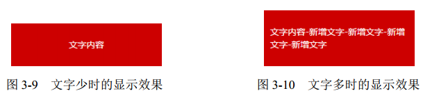
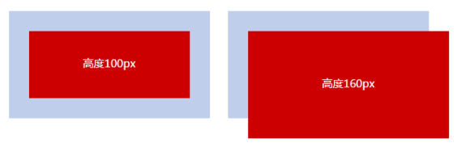

[toc]

### 概述

- 正常情况下从左到右，从上到下依次排列
- 流向可以改变
- 特殊布局场景下对流的破坏

### 流、元素和基本尺寸

#### 块级元素 vs `display:block`

块级元素并不等同于 `display:block`的元素，因为 `li`,`table`的 display 值分别是`list-item`和`table`，但它们都是块级元素，因为它们都符合块级元素的基本特征，也就是水平流上只能显示一个元素，多个则换行显示。

正是由于它们都是块级元素，所以它们都能用来清除浮动

```css
.clear:after {
  content: '';
  /* 也可以是list-item , block */
  display: table;
  clear: both;
}
```

#### width:auto

- fill-available:div,p 这种块级元素默认是父级元素的 100%
- shrink-to-fit:浮动，绝对定位，inline-block 元素或 table 元素
- min-content:收缩到最小

#### 外部尺寸与流体特性

所谓流动性，并不是看上去的宽度 100%显示这么简单，而是一种 margin/border/padding
和 content 内容区域自动分配水平空间的机制。

- 对于 display:block 的元素不需要设置 width:100%，width:100%会破坏盒子的流体特性
- 包裹性
  

```css
.box {
  text-align: center;
}
.content {
  display: inline-block;
  text-align: left;
}
```

#### 宽度分离

CSS 中的 width 属性不与影响宽度的 padding/border（有时候包括 margin）属性共存

- bad

```css
.box {
  width: 100px;
  padding: 20px;
}
```

- good

```css
.father {
  width: 180px;
}
.son {
  margin: 0 20px;
  padding: 20px;
  border: 1px solid;
}
```

#### height:100%

- 正常流布局

```css
.box {
  height: 160px;
  padding: 30px;
  box-sizing: border-box;
  background-color: #beceeb;
}
.child {
  height: 100%;
  background-color: #cd0000;
}
```

- 绝对定位

```css
.box {
  height: 160px;
  padding: 30px;
  box-sizing: border-box;
  background-color: #beceeb;
  position: relative;
}
.child {
  height: 100%;
  width: 100%;
  background-color: #cd0000;
  position: absolute;
}
```

正常流的高度百分比是相对于 content-box 的，绝对定位相对于 padding-box


#### max-height

- 元素展开动画

```css
.element {
  max-height: 0;
  overflow: hidden;
  transition: max-height 0.25s;
}
.element.active {
  max-height: 666px; /* 一个足够大的最大高度值 */
}
```

#### 幽灵空白节点

Each line box starts with a zero-width inline box with the element’s font and lineheight properties. We call that imaginary box a “strut”.

以下代码能证明幽灵空白节点确实存在

```css
div {
  background-color: #cd0000;
}
span {
  display: inline-block;
}
```

```html
<div><span> </span></div>
```

### 盒子

#### 替换元素

通过修改某个属性值呈现的内容就可以被替换的元素就称为“替换元素”

- 无法通过普通 css 更改元素内间距，背景色等样式
- 无内容时有默认尺寸 （大部分场景下是 300 x 150），也有的是 0，比如说 img 标签
- 在很多 CSS 属性上有自己的一套表现规则（比如说 vertical-align:baseline，正常元素是字母 x 的下边缘，在替换元素里则是元素的下边缘）

#### 替换元素的尺寸计算规则

css 尺寸 > html 尺寸 > 元素固有尺寸

#### 替换元素 vs 非替换元素

使用 content 属性生成的替换元素叫做匿名替换元素（也就是说普通元素可以通过添加 content 属性变成替换元素）
