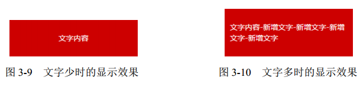

[toc]

### 概述

- 正常情况下从左到右，从上到下依次排列
- 流向可以改变
- 特殊布局场景下对流的破坏

### 流、元素和基本尺寸

#### 块级元素 vs `display:block`

块级元素并不等同于 `display:block`的元素，因为 `li`,`table`的 display 值分别是`list-item`和`table`，但它们都是块级元素，因为它们都符合块级元素的基本特征，也就是水平流上只能显示一个元素，多个则换行显示。

正是由于它们都是块级元素，所以它们都能用来清除浮动

```css
.clear:after {
  content: '';
  /* 也可以是list-item , block */
  display: table;
  clear: both;
}
```

#### width:auto

- fill-available:div,p 这种块级元素默认是父级元素的 100%
- shrink-to-fit:浮动，绝对定位，inline-block 元素或 table 元素
- min-content:收缩到最小

#### 外部尺寸与流体特性

所谓流动性，并不是看上去的宽度 100%显示这么简单，而是一种 margin/border/padding
和 content 内容区域自动分配水平空间的机制。

- 对于 display:block 的元素不需要设置 width:100%，width:100%会破坏盒子的流体特性
- 包裹性
  

```css
.box {
  text-align: center;
}
.content {
  display: inline-block;
  text-align: left;
}
```

#### 宽度分离

CSS 中的 width 属性不与影响宽度的 padding/border（有时候包括 margin）属性共存

- bad

```css
.box {
  width: 100px;
  padding: 20px;
}
```

- good

```css
.father {
  width: 180px;
}
.son {
  margin: 0 20px;
  padding: 20px;
  border: 1px solid;
}
```
