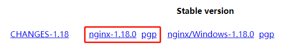
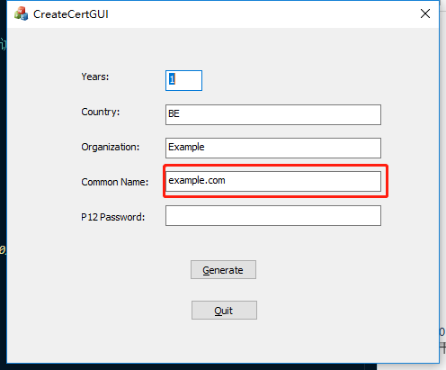

[toc]

### 安装 nginx

- 下载 nginx
  复制 nginx 下载路径
  

```sh
wget http://nginx.org/download/nginx-1.18.0.tar.gz
```

- 解压
  tar -zxf nginx-1.18.0.tar.gz

- 配置

```sh
# 支持https模块，如果不需要支持的话可以把后面的两个with去掉
./configure --prefix=/usr/local/nginx --with-http_stub_status_module --with-http_ssl_module
```

缺乏某些包或者依赖库

```sh
# 编译依赖于gcc，nginx是用c语言写的
yum install -y gcc

# 添加依赖库
# 正则支持
yum install -y pcre-devel
# openssl
yum install -y openssl openssl-devel
```

- 构建

```sh
make
```

- 首次安装
  覆盖的话需要先 make，然后手动把 objs/nginx 覆盖到目录下

```sh
make install
```

### FAQ

#### 配置完 nginx 并启动之后发现从外部无法访问

- 查看已开放端口

```sh
firewall-cmd --list-ports
```

- 开启 80 端口

```sh
# permanent:永久修改（写入文件）
firewall-cmd --zone=public --add-port=80/tcp --permanent
```

- 重启防火墙

```sh
firewall-cmd --reload
```

#### 生成本地 https 证书

CreateCertGUI



#### 配置 nginx

- 将生成的证书文件放在 conf 目录下

- 配置 nginx.conf

```sh
 server {
    listen 443 ssl;
    server_name nos.netease.com 192.168.209.130;
    ssl_certificate netease.com-cert-20200730-093235.crt;
    ssl_certificate_key netease.com-key-20200730-093235.pem;
    location / {
        #root /home/zgq;
        root html;
        index index.html index.htm;
    }
}
```
