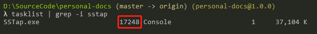
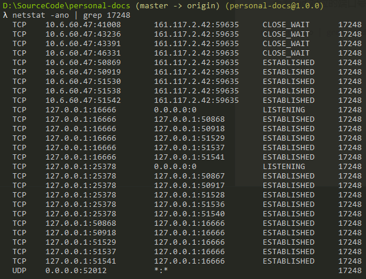
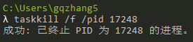

[toc]

### 查看某个软件的端口使用情况

- 安装 cmder
- 查看软件的 pid

```sh
tasklist | grep -i "软件名称"
```



- 查看 pid 对应的端口号

```sh
netstat -ano | grep {pid}
```



### 查看端口占用情况

- 使用 netstat 查看端口对应的 pid
- 使用 tasklist 找到 pid 对应的软件

### 关闭某个应用

- 先找到应用对应的 pid
- 使用 taskkill 杀掉应用

```sh
taskkill /f /pid {pid}
```


