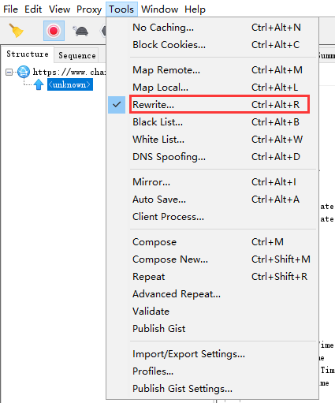
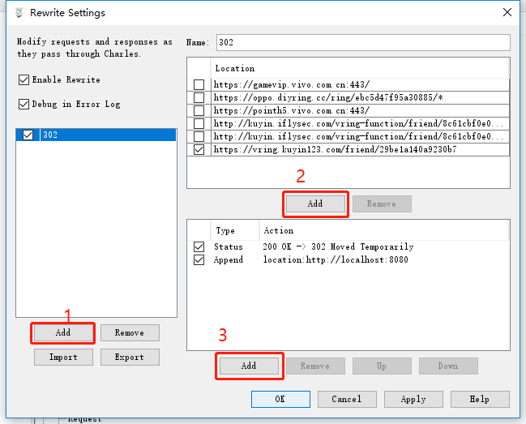

[toc]

### 背景

我们的 h5 页面在合作方 app 中出现了兼容性问题，同时，处于安全考虑，合作方不太方便为我们提供测试包，为了在客户端中测试 h5 页面，特写此文档说明如何搭相应的测试环境

### 思路

通过抓包工具抓取 app 现有 h5 页面链接，然后将此连接通过 302 跳转的方式指到测试环境链接，这样就能实现在客户端 webview 中测试 h5 页面的目的了。以下搭建过程以 charles 为例。

### 如何配置 302 跳转

- 选择 tools->rewrite
  

- 添加新的规则组，填写需要 rewrite 的地址（客户端原有链接）和跳转地址（测试环境地址）
  
