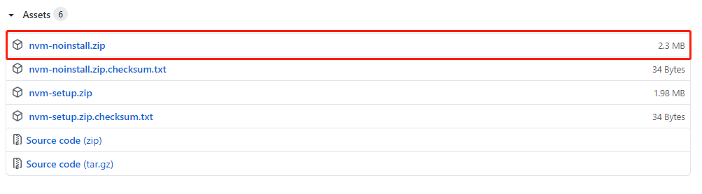
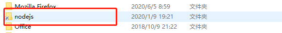
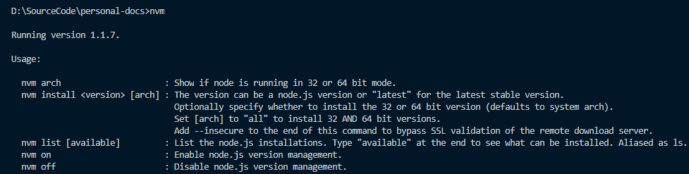
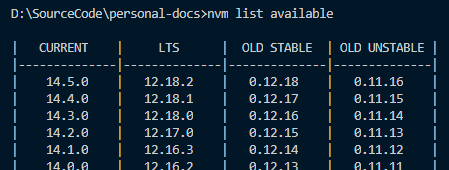
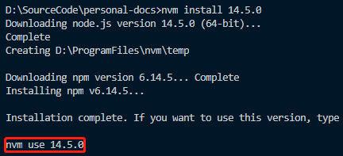
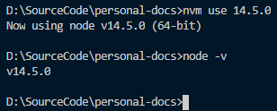

[toc]

### 背景

由于 node 版本更新太快，不同的 npm 包对于 node 的版本要求可能不同，这就需要我们可以在不同的 node 版本间方便的切换，nvm-windows 正是为此而生的。

### 安装

- 在 github 上下载 [nvm-windows](https://github.com/coreybutler/nvm-windows/releases)，这里我们下载当前最新版本的 nvm-noinstall.zip
  

- 下载完成后解压到某个地方（比如说 D:\ProgramFiles\nvm）

- 以管理员权限运行 install.cmd
  install 的文件内容如下所示，我们可以发现其实就是设置一些环境变量然后写入 当前目录下的 settings.txt 文件

```cmd
@echo off
set /P NVM_PATH="Enter the absolute path where the zip file is extracted/copied to: "
setx /M NVM_HOME "%NVM_PATH%"
setx /M NVM_SYMLINK "C:\Program Files\nodejs"
setx /M PATH "%PATH%;%NVM_HOME%;%NVM_SYMLINK%"

if exist "%SYSTEMDRIVE%\Program Files (x86)\" (
set SYS_ARCH=64
) else (
set SYS_ARCH=32
)
(echo root: %NVM_HOME% && echo path: %NVM_SYMLINK% && echo arch: %SYS_ARCH% && echo proxy: none) > %NVM_HOME%\settings.txt

notepad %NVM_HOME%\settings.txt
@echo on
```

- 手动打开 settings.txt 文件，查看下文件内容是不是对的

```js
//nvm安装目录，也就是我们上面解压的目录
root: D:\ProgramFiles\nvm
// nodejs路径（nvm默认会将所有node版本安装在nvm根目录下，
// 然后此nodejs路径会以软连接的方式指向nvm下的某个node版本）
path: d:\Program Files\nodejs
// 系统架构 64 vs 32
arch: 64
// 代理（国内访问外网可能需要代理，也修改下面的node镜像和npm镜像，不配置代理）
proxy: none
node_mirror: http://npm.taobao.org/mirrors/node/
npm_mirror: https://npm.taobao.org/mirrors/npm/
```



- 重新打开一个 cmd 窗口运行 `nvm`
  出现如下提示则安装成功
  

### 使用

- 列出所有可用的 node 版本

```sh
nvm list available
```



- 安装某个版本
  此命令会从我们之前指定的 node 镜像和 npm 镜像上下载 node 和 npm 安装包然后安装起来

```sh
nvm install 14.5.0
```



- 使用某个版本

```sh
nvm use 14.5.0
```

可以看到执行完 `nvm use {version}` 之后当前 node 版本就变了


