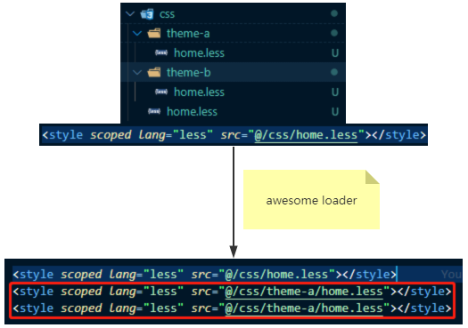
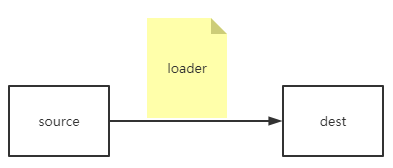
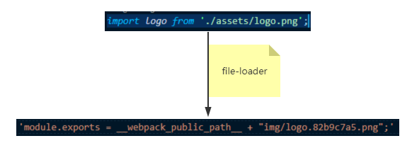
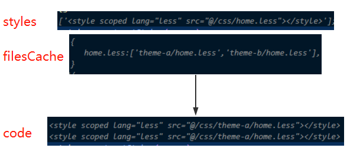

### 背景

> 本文介绍如何通过编写 webpack-loader 来优化开发体验

动态换肤对于前端而言可以说是一种非常常见的需求，常见的思路不外乎

- 加载不同的样式文件
- 将样式写在一套代码中，通过 class 切换
- css in js

本人所在的项目中由于使用了 scoped 来避免样式冲突，使得加载不同的样式文件变得困难（vue 中 scope 的实现机制是借助 PostCSS 插件将样式文件编译成带 hash 的形式，以此来隔离不同组件的样式，具体效果如下所示）

- 原始代码

```html
<style scoped>
  .example {
    color: red;
  }
</style>

<template>
  <div class="example">hi</div>
</template>
```

- 处理过后的代码

```html
<style>
  .example[data-v-f3f3eg9] {
    color: red;
  }
</style>

<template>
  <div class="example" data-v-f3f3eg9>hi</div>
</template>
```

这就导致如果有多套 css 文件正常情况下需要同时引入这多套文件，然后通过配置切割 chunk 来分隔不同的文件，嗯，明显这种方式开发体验不好，不同的样式文件同时加载导致样式错乱。这样，除了 css in js 这种方案之外就是通过 class 隔离样式了，也就是将不同皮肤的样式写在一起，通过 class 来进行区分。

```css
.a {
  /* rules */
}

.themeA .a {
  /* themeA rules */
}
```

当然，这种方式也会导致另外的问题，不同的主题样式写在一起可能会导致混乱，代码不够清晰。对于代码不够清晰的问题我们可以将不同主题的样式写在不同的文件中，然后同时引入（与方案 1 不同，采取了 class 的样式文件同时加载并不会导致样式错乱），相当于把原先一个文件拆分成多个文件，功能不变。

```html
<style scoped lang="less" src="themeA.less"></style>
<style scoped lang="less" src="themeB.less"></style>
```

当然，有人可能会觉得这样写起来有点麻烦，能不能只写一个默认的。借助 webpack-loader 以及一些命名约定我们可以轻松实现此需求。



### webpack-loader 简介

在动手实现上面的 awesome loader 之前我们先简要介绍下 webpack-loader

#### 什么是 loader？

默认情况下 webpack 无法识别 vue，ts，css，图片等文件类型，这些类型都需要借助合适的 loader 转化为 js 模块才能被 webpack 正确处理。



```js
module.exports = function awesomeLoader(source) {
  // 对source做一些变换
  return '变换后的source';
};
```

#### 举个例子



简化版 file-loader

```js
import loaderUtils from 'loader-utils';

export default function loader(content) {
  const options = loaderUtils.getOptions(this);

  const context = options.context || this.rootContext;
  const name = options.name || '[contenthash].[ext]';

  const url = loaderUtils.interpolateName(this, name, {
    context,
    content,
  });

  return `module.exports = __webpack_public_path__ + ${JSON.stringfy(url)}`;
}
```

### 着手实现我们的 awesome-loader

#### 目标


#### 大概思路

- 使用正则匹配出源码中所有的 style 标签，存入 styles 数组中

```ts
// ['<style scoped lang="less" src="@/css/home.less"></style>'];
let styles = extractStyles(source);

// 获取所有style标签
const styleReg = /<\s*style\s*[^>]+>\s*<\/\s*style\s*>/g;
function extractStyles(source = '') {
  return source.match(styleReg) || [];
}
```

- 读取 css 目录下所有的子目录，组装成 map 形式的数据

```ts
/*
 * {
 *    home.less:['theme-a/home.less','theme-b/home.less'],
 * }
 **/
let filesCache = getFilesMap(/*path of css*/);

/**
 * 读取某个目录的子目录下的文件组装成如下map形式
 * {
 *    a.less:['strong-dark/a.less','middle-dark/a.less','soft-dark/a.less'],
 *    b.less:['strong-dark/b.less','soft-dark/b.less']
 * }
 *
 * @param {string} dir 待读取目录
 */
export function getFilesMap(dir: string) {
  if (!fs.existsSync(dir)) {
    return {};
  }

  return fs.readdirSync(dir).reduce((acc, cur) => {
    const subPath = path.resolve(dir, cur);
    const stats = fs.lstatSync(subPath);
    if (stats.isDirectory()) {
      const subFiles = fs
        .readdirSync(subPath)
        .filter(cur => fs.lstatSync(path.resolve(subPath, cur)).isFile());
      subFiles.forEach(file => {
        if (!acc[file]) {
          acc[file] = [];
        }
        acc[file].push(`${cur}/${file}`);
      });
    }
    return acc;
  }, {});
}
```

- 通过 webpack-loader 在构建时改变代码
  这一步其实就是把前面两步拿到的东西拼接成最终的 code

  

```js
module.exports = function awesomeLoader(source) {
  // 这里的styles和filesCache是第一步和第二步拿到的style数组以及文件map
  const code = styles
    .map(style => {
      // extractStyleFileName的作用是从style标签中抽取文件名称
      // "<style src="@/css/home.less"></style>" => "home.less"
      return extractStyleFileName(style);
    })
    .filter(file => !!filesCache[file])
    .map(file =>
      filesCache[file]
        .map(
          themeFile =>
            `<style lang="less" scoped src="@/css/${themeFile}"></style>`,
        )
        .join('\n'),
    )
    .join('\n');

  return `${source}\n${code}`;
};
```

- 将我们的 awesome loader 加在 vue 文件的最后一个 loader 上
  这里之所以放在最后是因为 loader 默认的执行顺序是从右到左，也就是说 loader 数组的最后一个是最先执行的

```js
// webpack.config.js
module.exports = {
  module: {
    rules: [
      {
        test: /\.vue$/,
        use: [
          // vue-loader ...
          {
            loader: 'path of our awesome loader',
            options: {
              // 参数
            },
          },
        ],
      },
    ],
  },
};
```

#### 完整代码

```ts
import { getOptions } from 'loader-utils';
import fs from 'fs';
import path from 'path';

let filesCache: Record<string, Array<string>>;
/**
 * @param {string} source
 */
export default function (source: string) {
  const { skin, srcPath } = getOptions(this);
  const callback = this.async();

  if (!filesCache) {
    filesCache = getFilesMap(srcPath);
  }

  const styles = extractStyles(source).filter(style =>
    /src\s*=\s*/.test(style),
  );
  // 全部是内联样式则不需要处理，提前结束本loader
  if (styles.length === 0) {
    callback(null, source);
    return;
  }

  const styleFilesMap: Record<
    string,
    { lang: string; scoped: boolean }
  > = styles.reduce((acc, cur) => {
    const fileName = extractStyleFileName(cur);
    if (!fileName) {
      return acc;
    }
    const extension = extractExtension(fileName);
    const hasScoped = /scoped/.test(cur);
    acc[fileName] = {
      lang: extension,
      scoped: hasScoped,
    };
    return acc;
  }, {});

  const prefix = skin ? `@/skin/${skin}/css` : '@/css';
  const code = Object.keys(styleFilesMap)
    .filter(file => !!filesCache[file])
    .map(file => {
      const { lang, scoped } = styleFilesMap[file];
      return filesCache[file]
        .map(
          filePath =>
            `<style lang="${lang}" ${
              scoped ? 'scoped' : ''
            } src="${prefix}/${filePath}"></style>`,
        )
        .join('\n');
    })
    .join('\n');

  callback(null, `${source}\n${code}`);
}

// 获取所有style标签
const styleReg = /<\s*style\s*[^>]+>\s*<\/\s*style\s*>/g;
function extractStyles(source = '') {
  return source.match(styleReg) || [];
}

// 获取文件扩展名
const extensionReg = /\.(\w+)$/;
export function extractExtension(name = '') {
  const match = name.match(extensionReg);
  return match && match[1];
}

// 获取style标签里的src属性值
const reg = /@\/css\/([^/.]+\.\w+)/;
export function extractStyleFileName(source = '') {
  const match = source.match(reg);
  return match && match[1];
}

/**
 * 读取某个目录的子目录下的文件组装成如下map形式
 * {
 *    a.less:['strong-dark/a.less','middle-dark/a.less','soft-dark/a.less'],
 *    b.less:['strong-dark/b.less','soft-dark/b.less']
 * }
 *
 * @param {string} dir 待读取目录
 */
export function getFilesMap(dir: string) {
  if (!fs.existsSync(dir)) {
    return {};
  }

  return fs.readdirSync(dir).reduce((acc, cur) => {
    const subPath = path.resolve(dir, cur);
    const stats = fs.lstatSync(subPath);
    if (stats.isDirectory()) {
      const subFiles = fs
        .readdirSync(subPath)
        .filter(cur => fs.lstatSync(path.resolve(subPath, cur)).isFile());
      subFiles.forEach(file => {
        if (!acc[file]) {
          acc[file] = [];
        }
        acc[file].push(`${cur}/${file}`);
      });
    }
    return acc;
  }, {});
}
```
