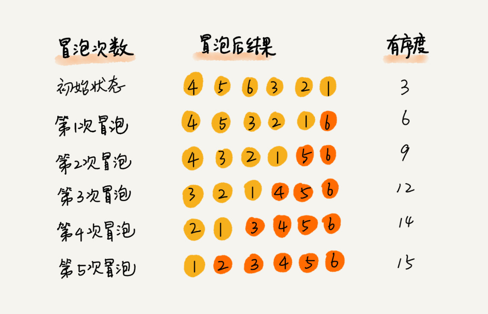

[toc]

> 笔记中截图来自[极客时间-数据结构与算法之美
> ](https://time.geekbang.org/column/intro/126)

### 如何抓住重点，系统高效地学习数据结构与算法

从广义上来说数据结构指的是数据的存储结构，算法指的是作用在数据之上的操作。

数据结构是为算法服务的，而算法需要作用在特定的数据结构之上。

#### 学习的重点

复杂度分析

#### 数据结构与算法的大致内容


#### 应付面试或工作的核心内容：

10 个数据结构：数组、链表、栈、队列、散列表、二叉树、堆、跳表、图、Trie 树；
10 个算法：递归、排序、二分查找、搜索、哈希算法、贪心算法、分治算法、回溯算法、动态规划、字符串匹配算法。

#### 学习心法

- 学习算法的来历，自身的特点，适合解决的问题以及实际的应用场景
- 学习的过程中多问为什么

#### 学习技巧

- 边学边练，适度刷题
- 多问，多思考，多互动

### 复杂度分析

#### 技巧

- 只关注循环次数最多的一段代码
- 加法法则：总的时间复杂度就等于量级最大的那段代码的时间复杂度
- 乘法法则：嵌套代码的复杂度等于嵌套内外代码复杂度的乘积

#### 概念

- 最好情况时间复杂度
- 最坏情况时间复杂度
- 平均情况时间复杂度
- 均摊时间复杂度

```c

 // array表示一个长度为n的数组
 // 代码中的array.length就等于n
 int[] array = new int[n];
 int count = 0;

 void insert(int val) {
    if (count == array.length) {
       int sum = 0;
       for (int i = 0; i < array.length; ++i) {
          sum = sum + array[i];
       }
       array[0] = sum;
       count = 1;
    }

    array[count] = val;
    ++count;
 }
```

对一个数据结构进行一组连续操作中，大部分情况下时间复杂度都很低，只有个别情况下时间复杂度比较高，而且这些操作之间存在前后连贯的时序关系，这个时候，我们就可以将这一组操作放在一块儿分析，看是否能将较高时间复杂度那次操作的耗时，平摊到其他那些时间复杂度比较低的操作上。而且，在能够应用均摊时间复杂度分析的场合，一般均摊时间复杂度就等于最好情况时间复杂度。

### 链表

#### 技巧

- 警惕指针丢失和内存泄漏（对于无垃圾回收的语言需要注意回收内存）
- 利用哨兵简化对于边界条件的特殊处理
- 关注边界场景下代码能否正常工作
  - 空链表
  - 只有一个节点的链表
  - 只有两个节点的链表
  - 头结点和尾节点的处理
- 通过画图来辅助思考

#### 链表常见操作

- 单链表反转

```js
function reverse(node) {
  if (!node || !node.next) {
    return node;
  }

  let dummy = new Node(-1);
  dummy.next = node;

  let prev = node;
  let cur = node.next;
  while (cur !== null) {
    prev.next = cur.next;
    cur.next = dummy.next;
    dummy.next = cur;

    cur = prev.next;
  }

  return dummy.next;
}
```

- 链表中环的检测

```js
// 利用快慢指针同时遍历链表，若链表存在环则快慢指针在某次访问中一定会相遇
function detect(node) {
  if (node == null) {
    return false;
  }

  let slow = node;
  let fast = node.next;
  while (fast !== null && fast.next !== null) {
    slow = slow.next;
    fast = fast.next.next;

    if (slow === fast) {
      return true;
    }
  }

  return false;
}
```

```js
// 遍历节点，缓存访问过的节点，若存在环则在某次访问一定会访问到已经访问过的节点
function detect(node) {
  const visited = new WeakMap();
  let current = node;

  while (current !== null) {
    if (visited.get(current)) {
      return true;
    }
    visited.set(current, true);
    current = current.next;
  }

  return false;
}
```

- 两个有序链表的合并

```js
/**
 * 新建个空节点
 * 同时遍历两个链表
 * 将其中小的节点插入新节点的末尾
 * 重复23步直到某个链表为空
 * 将另一个链表插入到新链表的后面即可
 */
function merge(node1, node2) {
  const guide = new Node(-1);

  let guideIndex = guide;
  let index1 = node1;
  let index2 = node2;
  while (index1 !== null && index2 !== null) {
    if (index1.value <= index2.value) {
      guideIndex.next = index1;
      guideIndex = guideIndex.next;
      index1 = index1.next;
    } else {
      guideIndex.next = index2;
      guideIndex = guideIndex.next;
      index2 = index2.next;
    }
  }
  guideIndex.next = index1 !== null ? index1 : index2;

  return guide.next;
}
```

- 删除链表倒数第 n 个节点

```js
/**
 * 双指针法
 * a指向头节点 b指向第n个节点
 * a和b同时前进，b到达尾节点时a正好是倒数第n个节点
 */
```

```js
// 两次遍历，第一次遍历拿到链表长度，第二次遍历到 len - n 处停止
```

- 求链表的中间节点

```js
// 快慢指针法
```

### 排序

- 冒泡排序
  

```js
function bubbleSort(arr) {
  for (let i = 0; i < arr.length; i++) {
    // 如果某轮冒泡没有任何交换说明所有数据已经有序，可以提前结束冒泡
    let flag = false;
    for (let j = 0; j < arr.length - i - 1; j++) {
      if (arr[j] > arr[j + 1]) {
        flag = true;
        swap(arr, j, j + 1);
      }
    }
    if (!flag) {
      break;
    }
  }

  return arr;
}

function swap(arr, i, j) {
  let tmp = arr[i];
  arr[i] = arr[j];
  arr[j] = tmp;
}
```

- 插入排序


```js
function insertSort(arr) {
  for (let i = 1; i < arr.length; i++) {
    const current = arr[i];
    let j = i - 1;
    while (j >= 0 && arr[j] > current) {
      arr[j + 1] = arr[j];
      j--;
    }
    // 这里是j+1而不是j，通过循环找到的位置是j，但是找到之后推出循环的时候会执行j--
    arr[j + 1] = current;
  }

  return arr;
}
```

- 选择排序
  

```js
// 将数组分成已排序和未排序两组，每次从未排序的数据中选出最小值与已排序数据的末尾值进行交换
function selectSort(arr) {
  for (let i = 0; i < arr.length; i++) {
    let j = i;
    let minIndex = j;
    let min = arr[j];
    for (; j < arr.length; j++) {
      if (min > arr[j]) {
        let tmp = arr[j];
        arr[j] = min;
        min = tmp;
        minIndex = j;
      }
    }

    // 本次交换会破坏排序稳定性
    let tmp = arr[i];
    arr[i] = min;
    arr[minIndex] = tmp;
  }

  return arr;
}
```

- 归并排序
  

```js
function mergeSort(arr) {
  sort(arr, 0, arr.length - 1);
  return arr;
}

function sort(arr, start, end) {
  if (start < end) {
    // js整数运算会得到小数，这里需要使用Math.floor确保得到的值是整数
    const mid = Math.floor(start + (end - start) / 2);
    sort(arr, start, mid);
    sort(arr, mid + 1, end);
    merge(arr, start, mid, end);
  }
}

function merge(arr, start, mid, end) {
  // 双下标法同时遍历两个数组
  let i = start;
  let j = mid + 1;
  let k = 0;
  const tmp = [];
  while (i <= mid && j <= end) {
    tmp[k++] = arr[i] <= arr[j] ? arr[i++] : arr[j++];
  }

  // 将剩余数组copy到tmp中
  if (i > mid) {
    arr.slice(j, end + 1).forEach(val => tmp.push(val));
  } else {
    arr.slice(i, mid + 1).forEach(val => tmp.push(val));
  }

  // 将tmp的内容copy回arr
  for (i = 0; i <= end - start; i++) {
    arr[start + i] = tmp[i];
  }
}
```

- 快速排序

```js
function quickSort(arr) {
  sort(arr, 0, arr.length - 1);
  return arr;
}

function sort(arr, start, end) {
  if (start < end) {
    const p = partition(arr, start, end);
    // 此处是p-1，不是p
    sort(arr, start, p - 1);
    sort(arr, p + 1, end);
  }
}

/**
 * 我们通过游标 i 把 A[p...r-1]分成两部分。A[p...i-1]的元素都是小于 pivot 的，
 * 我们暂且叫它“已处理区间”，A[i...r-1]是“未处理区间”。
 * 我们每次都从未处理的区间 A[i...r-1]中取一个元素 A[j]，与 pivot 对比，
 * 如果小于 pivot，则将其加入到已处理区间的尾部，也就是 A[i]的位置。
 * */
function partition(arr, start, end) {
  let i = start;
  const p = arr[end];
  for (let j = i; j <= end - 1; j++) {
    if (arr[j] < p) {
      swap(arr, i, j);
      i++;
    }
  }
  swap(arr, i, end);
  return i;
}

function swap(arr, i, j) {
  let tmp = arr[i];
  arr[i] = arr[j];
  arr[j] = tmp;
}
```

### 二叉树

- 前序遍历

```js
// 中后序遍历与此类似，不再赘述
function preTraverse(node) {
  if (node === null) {
    return;
  }
  console.log(node.data);
  preTraverse(node.left);
  preTraverse(node.right);
}
```

- 按层遍历

```js
// 借助队列来实现
function levelTraverse(root) {
  const queue = [root];
  while (queue.length !== 0) {
    const node = queue.shift();
    console.log(node.value);

    if (node.left) {
      queue.push(node.left);
    }
    if (node.right) {
      queue.push(node.right);
    }
  }
}
```

- 树的高度
  

```js
function getHeight(root) {
  if (!root) {
    return 0;
  }
  return Math.max(getHeight(root.left), getHeight(root.right)) + 1;
}
```

### 递归

- 一个问题的解可以分解为几个子问题的解
- 这个问题与分解之后的子问题，除了数据规模不同，求解思路完全一样
- 存在递归终止条件

注意事项：

- 警惕堆栈溢出（设置最大调用次数）
- 避免重复计算（计算结果缓存）
