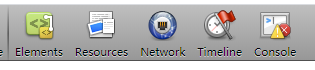
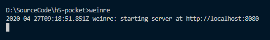
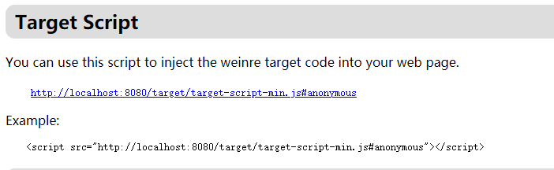
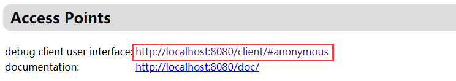
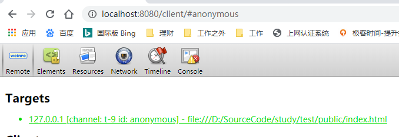

[toc]

### weinre

#### weinre 能做什么？


如图所示，审查页面元素，修改页面样式，查看资源，网络等

#### weinre 不能做什么？

js 调试

#### 如何使用

- 安装 weinre

```js
npm i -g weinre
```

- 启动 weinre

```js
npx weinre
```

正常启动后 weinre 会在控制台打印一条日志


- 在浏览器中打开第二步打印的地址（本文是 http://localhost:8080）
- 在打开的页面找到 Target Script
  
- 在待调试页面加入上面的脚本
- 在手机端访问待调试页面
- pc 端访问如下地址
  
  不出意外的话待调试页面会展示在 Targets 列表中，接下来就可以直接调试啦
  

### chrome 远程调试

#### chrome 远程调试能做什么？

和 pc 端一致的调试体验，功能强大

#### 局限性

手机端安卓版本 4.4 以上，需要安装 chrome 手机或 webview 需要开启 chrome 调试开关（对于好商量的合作方可让对方提供开启了调试开关的 app 用于调试页面）

```js
WebView.setWebContentsDebuggingEnabled(true);
```

具体操作步骤见如下链接（需访问外网~）
[remote-debugging](https://developers.google.cn/web/tools/chrome-devtools/remote-debugging/webviews?hl=zh-cn)

### eruda

#### eruda 能做什么？

在手机上直接审查 dom 元素，样式，执行 js 脚本

#### eruda 不能做什么？

js 调试

#### 怎么用？

- 在测试页面的 html 中加入以下代码

```html
<script src="//cdn.bootcss.com/eruda/1.4.2/eruda.min.js"></script>
<script>
  eruda.init();
</script>
```

- 在测试页面的 js 中加入以下代码

```js
function test() {
  var script = document.createElement('script');
  script.src = '//cdn.bootcss.com/eruda/1.4.2/eruda.min.js';
  document.body.appendChild(script);
  script.onload = function () {
    eruda.init();
  };
}
test();
```
