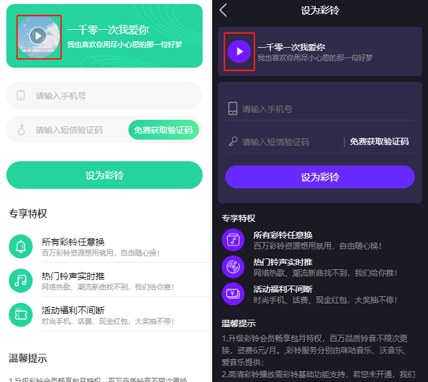
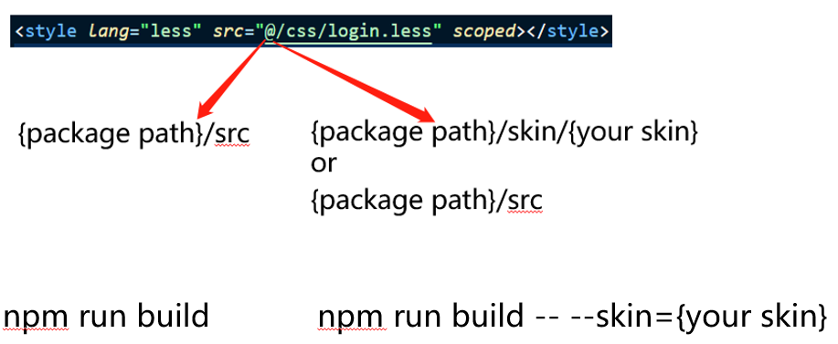
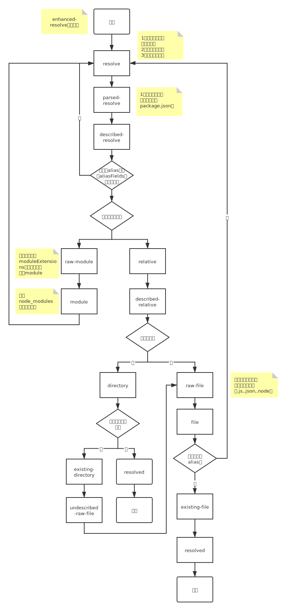

[toc]

### 背景

酷音 H5 这边主要做的是彩铃业务，我们的 H5 页面会投放到合作方的 app 里面，然后因为是放在 app 里面所以页面风格、配色这些东西就需要和 app 原来的页面保持一致，这就需要 H5 这边开发很多功能类似，但是页面结构和配色不同的页面，当合作方众多的时候同时维护如此多的页面对于我们来说算是个不小的工作量，目前我们的 h5 页面已经有上千个渠道接入~

- dom 结构相差很大的页面
  

- 仅页面配色，元素间距，图标等不一样的页面
  

- 大部分 dom 结构类似，仅局部不同的页面
  

### 目标



### 解决思路

Webpack 采用的模块解析包是 enhanced-resolve，两者的核心功能都是通过插件来实现的，那我们写个 enhanced-resolve 插件来自定义解析`@`符号应该就行了。

### 难点

无现成方案可参考，enhanced-resolve 库本身缺乏详细的 api 文档供插件开发者阅读，同时，为了实现高可配，enhanced-resolve 本身设计的比较抽象，阅读源码有一定的难度

### enhanced-resolve 解析流程

enhanced-resolve 是 webpack 为了实现高可配的模块解析而专门开发的一个库，依赖于 tapable，支持通过插件的形式改变其行为

以下是通过阅读源码绘制的简化版模块解析流程图


### 实现思路

- 注册 describe-resolve 钩子
- 判断当前模块是否匹配某个 alias
- 使用用户传入的路径替换 alias 并判断新的路径是否存在
- 存在就用新路径发起 resolve 流程，否则不做处理

### 使用方式

```js
chainWebpack: (config) => {
  if (skin) {
    config.resolve.plugin("skin-resolve-plugin").use(
      new SkinResolvePlugin({
        pattern: /~?@.*\.(less|css|scss|sass|png|jpg|gif|jpeg|vue)/,
        skinPath: path.resolve(__dirname, `src/skin/${skin}`),
        alias: config.resolve.alias.entries(),
      })
    );
  }
};
```

### 插件源码

```js
const path = require("path");
const fs = require("fs");

// https://github.com/webpack/enhanced-resolve
module.exports = class SkinResolvePlugin {
  /**
   *
   * @param {object} param0
   * @param {RegExp} param0.pattern 指定哪些文件需要经过本插件处理
   * @param {string} param0.skinPath 替换路径
   * @param {Object<string,string>} param0.alias alias
   */
  constructor({ pattern = /.*/, skinPath, alias } = {}) {
    this.options = {
      pattern,
      skinPath,
      alias,
    };
  }

  apply(resolver) {
    const { pattern, skinPath, alias } = this.options;

    // 未配置alias场景不需要注册本插件~
    if (Object.keys(alias).length === 0) {
      return;
    }

    resolver
      .getHook("described-resolve")
      .tapAsync("SkinResolvePlugin", (request, resolveContext, callback) => {
        /**
         * @type {string}
         */
        const innerRequest = request.request || request.path;

        // 不需要处理的文件提前结束本插件
        if (!pattern.test(innerRequest)) {
          return callback();
        }

        const keys = Object.keys(alias);
        let i = keys.length;

        while (i--) {
          const key = keys[i];

          if (innerRequest.startsWith(key)) {
            const innerRequestWithoutAlias = innerRequest.substr(key.length + 1);
            const newRequestStr = path.resolve(skinPath, innerRequestWithoutAlias);

            // 替换路径不存在提前结束
            if (!fs.existsSync(newRequestStr)) {
              continue;
            }

            // 使用替换路径发起新的resolve流程
            const obj = Object.assign({}, request, {
              request: newRequestStr,
            });

            return resolver.doResolve(
              "resolve",
              obj,
              `SkinResolvePlugin ${newRequestStr}`,
              resolveContext,
              (err, result) => {
                if (err) return callback(err);
                // Don't allow other aliasing or raw request
                if (result === undefined) return callback(null, null);
                return callback(null, result);
              }
            );
          }
        }

        return callback();
      });
  }
};
```
