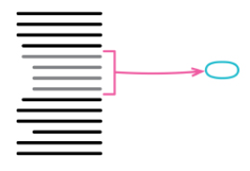
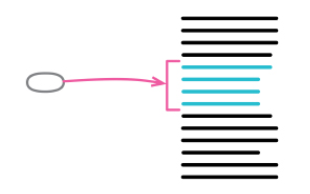
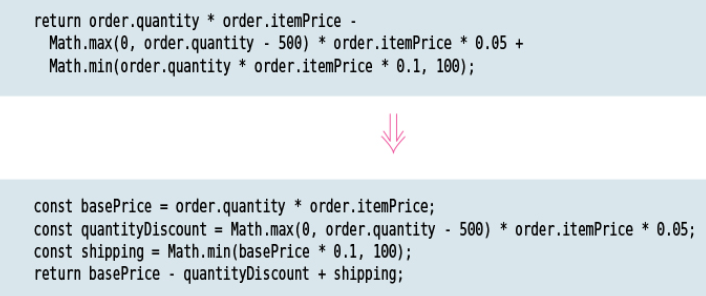
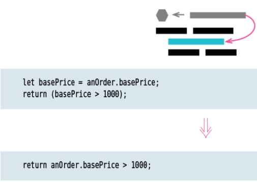

## 重构的基本原则

### 关于重构的定义

重构：在不改变软件可观测行为的情况下优化代码的内部结构使得其易于理解，易于修改

### two hats

添加新功能 vs 重构

添加新功能时不改变现有代码的内部结构，仅添加新功能，添加针对新功能的测试代码。重构时仅优化代码内部结构（使得添加新功能更为容易且代码更易于理解）。正常情况下，重构不应该添加任何测试代码。一旦觉得添加新功能或者测试难以进行时就需要进行重构。

### 为什么需要重构？

- 重构可以改善既有代码的设计
  由于各种各样的原因，人们处于短期目标对代码库做出的修改很可能是不符合代码整体架构的，比如说同样的功能在公用模块中已经实现了，但是你没看到或者公用模块里的实现不满足你的定制需求，于是为了解决问题你直接把公用模块的实现复制到私有模块中加以修改。而重复代码会给后期维护带来很大的问题。
- 重构使得软件易于理解
  通常情况下我们在实现一个功能的时候可能不会考虑可读性，我们只关注代码能不能正常执行，功能是否正常实现。通过重构我们有机会优化代码的内部结构，使得代码能更好的表达我们的意图，更容易被别人所理解。
- 重构能帮助我们发现 bug
  重构能帮助我们理解代码，弄清楚代码的结构，随着代码结构愈加清晰，bug 会愈加无所遁形
- 重构使得添加新功能变得容易
  糟糕的代码使得添加新功能变得困难且容易引入 bug，设计糟糕的代码会随着时间的发展变得越来越难以维护。

### Preparatory Refactoring-Making It Easier to Add a Feature

进行重构的最好时机是在你准备添加新功能或者修复 bug 之前。比如说在你添加新功能之前现有代码库中已经有类似功能的函数，只不过需要做些改动，偷懒的方式就是直接复制现有代码，然后加以改动，但是这样就为代码库引入了重复代码（日后需要修改的时候就需要同时修改两个地方，这显然是不可接受的）。

### Comprehension Refactoring-Making Code Easier to Understand

修改代码之前需要先理解代码，对于那些需要花费精力才能弄明白的代码可以考虑下能否通过重构使得理解代码意图更为容易，这样别人在看代码的时候也会更为容易。

### 重构带来的问题

- 降低添加新功能的速度

## 代码的坏味道

- 神秘的命名
  好的命名可以让人对于代码本身的意图一目了然，提高代码可读性。差的命名让人不明所以，拼音和英文混用，不符合命名规范（比如说驼峰命名法），词不达意（名字和实际想表达的意思不一致）
- 重复
  重复代码有个最大的坏处就是当你需要修改的时候你很有可能会漏掉某些地方，且由于大部分重复代码都是因为当初有局部无法满足需求，这使得后期修改更为困难
- 长函数
  长函数通常意味着我们在一个函数里做了太多的事情，这使得为代码命名更为困难，且同时做多件事明显不利于代码复用（当然，也可以在日后需要复用的时候考虑通过抽取函数的方式优化代码行数），通过变量查询来优化过多的参数，使用参数对象替换参数列表
- 长参数列表
  过多的参数列表（比如说大于 2 个）使得调用函数变得困难。大于等于 3 个参数可以考虑使用参数对象来传参。参数对象一方面可以有效改善长参数列表带来的调用问题（某些场景下我们可能不需要传入过多的参数，这时候我们就需要显式传入 null 或 undefined，同时，过多的参数还会限制我们不能搞错参数顺序，参数对象可以很好的解决这两个问题，且参数对象可扩展，不会影响到现有功能）
- 全局数据
  可变的全局数据如果不做限制的话会使得调试极为困难，且容易出现很多莫名其妙的问题（想象一下，你依赖的数据莫名其妙的就被其他人修改了）
- 可变数据
  与全局变量类似，不受限的可变数据会导致出现一些神奇的 bug（不是说一定要用不可变数据，而是数据的变化需要可追踪，可控）
- Divergent Change
  软件要易于修改（软件不是一成不变的，随着时间的发展，我们必然需要为软件添加更多的功能，修复 bug），所谓的 Divergent Change 指的就是每次我们需要修改某个地方的时候可能需要同时修改好几个地方
- Primitive Obsession
  使用对象封装基础类型可以简化我们对于基础类型的操作。比如说金钱，直接用数字是不对的，可能会出现 3 角大于 2 元的情况（单位），使用对象封装对金钱类型的操作是个比较明智的选择，可以有效避免单位的问题。
- 循环
  使用 functor 替代循环（循环本身不是我们关注的内容，且循环写起来更费时间）
- 内部函数，内部类
  对于那些不需要被外部使用的函数或类可以通过内部函数内部类的形式减小其作用域
- 提前加入对不存在场景的处理逻辑
- 注释
  好的注释需要解释为什么要这么做而不是代码本身做了什么

## 重构手法

### 抽取函数（抽取方法）



#### Motivation

我们在看代码的时候可能会遇到这种情况，某些代码片段需要花费点时间才能弄懂代码本身干了什么，这时候如果通过抽取函数的形式将这些代码块放在一起，然后用代码块本身的意图来为抽取出来的函数命名，这样下次再看的时候只需要通过函数名就能知道代码块本身的意图了。

#### 技术细节

- 创建一个新函数，使用待抽取代码片段的意图为函数命名(name it by what
  it does, not by how it does it)
- 将代码片段 copy 到新函数中
- 找出新函数中那些仅存在于原先函数上下文中的局部变量，通过传参的形式传入
- 将原函数中的代码片段替换成新函数
- 测试
- 检查代码库中是否有其他类似重复的代码片段（有的话也替换成新函数）

#### 例子

- before

```js
function printOwing(invoice) {
  let outstanding = 0;
  console.log('***********************');
  console.log('**** Customer Owes ****');
  console.log('***********************');

  // calculate outstanding
  for (const o of invoice.orders) {
    outstanding += o.amount;
  }

  // record due date
  const today = Clock.today;
  invoice.dueDate = new Date(
    today.getFullYear(),
    today.getMonth(),
    today.getDate(),
  );

  //print details
  console.log(`name: ${invoice.customer}`);
  console.log(`amount: ${outstanding}`);
  console.log(`due: ${invoice.dueDate.toLocaleDateString()}`);
}
```

- after

```js
function printOwing(invoice) {
  printBanner();
  const outstanding = calculateOutstanding(invoice);
  recordDueDate(invoice);
  printDetails(invoice, outstanding);
}

function calculateOutstanding(invoice) {
  let result = 0;
  for (const o of invoice.orders) {
    result += o.amount;
  }
  return result;
}

function recordDueDate(invoice) {
  const today = Clock.today;
  invoice.dueDate = new Date(
    today.getFullYear(),
    today.getMonth(),
    today.getDate(),
  );
}

function printBanner() {
  console.log('***********************');
  console.log('**** Customer Owes ****');
  console.log('***********************');
}

function printDetails(invoice, outstanding) {
  console.log(`name: ${invoice.customer}`);
  console.log(`amount: ${outstanding}`);
  console.log(`due: ${invoice.dueDate.toLocaleDateString()}`);
}
```

当然，重构过后的代码还有不少可以改进的地方，比如说 calculateOutstanding 可以用 reduce 来实现（减少无意义的中间变量），但是这已经不是抽取函数这一步该做的事情了，重构的步子要小一点，避免引入 bug 而把时间浪费在调试 bug 上。

```js
function calculateOutstanding(invoice) {
  return invoice.orders.reduce((acc, cur) => acc + cur.amount, 0);
}
```

### 内联函数



#### Motivation

某些情况下代码片段本身已经很好的说明了其意图，这种情况下使用代码片段本身比再用一个函数去抽取这些代码片段要好一点。

#### 技术细节

- 检查方法本身是否是多态的（比如说父类中的某个方法在子类中会进行覆盖，那我们就不能内联父类中的这个方法）
- 找到所有的调用
- 使用函数体替换所有函数调用
- 每次替换之后测试
- 移除函数声明

### 抽取变量




#### Motivation

正如上面的例子所示，表达式过长时会变得难以阅读，抽取局部变量可以有效缓解这种问题。

### 变量内联


