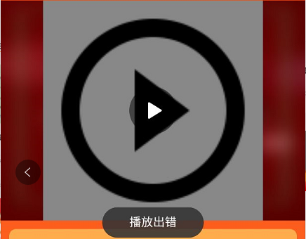

[toc]

### 常见问题

#### 自动播放

[autoplay-policy-changes](https://developers.google.com/web/updates/2017/09/autoplay-policy-changes)

由于浏览器限制，视频和音频必须由用户行为触发，要想实现自动播放可以想办法绕过这种机制，比如说用户点击页面的时候先播放然后立马停止视频，等用户进入视频预览页面时再自动播放视频。

> 解决方案

1、 初始化一个全局的 Video 对象，此对象全程唯一，不重复创建。

```js
videoElem = document.createElement("video");
```

2、 预览页上放置个视频插槽，用户点击播放的时候获取插槽上的视频地址，然后用这个地址去初始化第一步的全局 video 对象，再把这个 video 对象动态插入到插槽中

// 预览页上的视频插槽

```html
<van-swipe-item v-for="video in resList" :key="video.id">
  
  <div class="video-bg-mask"></div>
  <div v-lazy:background-image="video.poster" class="poster" />
  <div class="video-slot" :data-src="video.url" @click="playVideo" />
  <div class="play-icon" :class="playStatus" />
</van-swipe-item>
```

// 用户点击播放视频

```js
playVideo() {
  const slot = document.querySelectorAll('.video-slot')[
    this.index
  ] as HTMLDivElement;
  curPoster = document.querySelectorAll('.poster')[
    this.index
  ] as HTMLDivElement;
  const url = slot.dataset.src as string;

  this.$player.play(url, slot);
}
```

// 用插槽中的 url 初始化全局 video 并动态插入到插槽中

```js
play(url: string, slot: HTMLElement) {
  const video = this.videoElem;
  if (!video.paused && video.src) {
    video.pause();
    return;
  }

  if (!slot) {
    return;
  }

  if (!url || video.src !== url) {
    video.src = url;
  }

  if (!video.parentElement) {
    slot.appendChild(video);
  }

  const promise = video.play();

  if (promise) {
    promise.catch(err => {
      // eslint-disable-next-line no-console
      console.log(err);
    });
  }
}
```

#### poster 兼容性问题

搞个 div 作为 poster，视频没播放的时候展示此 div，视频播放了再把 poster 隐藏起来

#### video 层级最高

无解，只能从 ui 交互上进行优化（比如说非全屏播放，下方可以放一些操作按钮，或者拿到兼容性数据然后根据兼容性数据展示不同的 ui）

#### 同层播放

```js
this.videoElem.setAttribute("playsinline", "true");
this.videoElem.setAttribute("webkit-playsinline", "true");
// https://x5.tencent.com/tbs/guide/video.html
this.videoElem.setAttribute("x5-video-player-type", "h5-page");
```

#### 客户端默认 poster 问题



> 等视频开始播放的时候再展示 video 原始

```js
this.videoElem.addEventListener("timeupdate", () => {
  this.mitt.emit("timeupdate");
  // 这里等视频开始播放之后再展示视频，避免某些手机上展示视频组件默认poster图片，
  // 这里之所以写10**-6是因为在部分老机子上写大于0还是会展示默认poster图案
  if (this.videoElem.currentTime > 10 ** -6) {
    this.videoElem.style.display = "block";
  }
});
```
