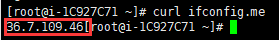
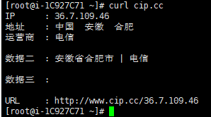

### FAQ

- vscode 配置 socks 代理

https://bread-whisper.now.sh/2020/02/28/vscode-socks5-proxy-setting/

- git 设置与取消代理

```sh
#  设置代理
git config --global http.proxy 'socks4://localhost:1080'
git config --global https.proxy 'socks4://localhost:1080'

# 取消代理
git config --global --unset http.proxy
git config --global --unset https.proxy
```

- 查看设备出口 ip

```sh
curl ifconfig.me
```



```sh
curl cip.cc
```


