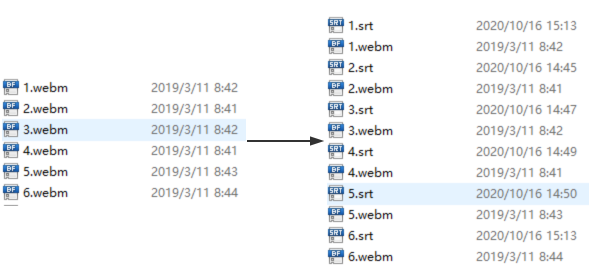
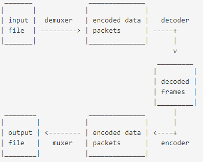
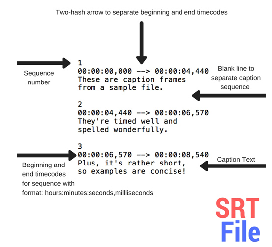

### 介绍

自动为指定目录下的视频文件解析并添加对应的音频文件

### 如何使用

- 安装 ffmpeg
  [download ffmpeg](https://ffmpeg.org/download.html)
- 安装本工具

```sh
npm i -g auto-add-subtitle
```

- 使用

```sh
auto-add-subtitle {视频所在目录（默认是当前目录）}
```



### 参考资料

- [axios-download-progress-in-node-js](https://futurestud.io/tutorials/axios-download-progress-in-node-js)
- [ffmpeg guide](https://gist.github.com/protrolium/e0dbd4bb0f1a396fcb55)

### 待实现功能

- 支持使用其他网站并发解析字幕

### 视频基本概念



- container format
  avi,mp4 这种属于容器类型
- frame rate
  images per second
- bitrate
  bits per second
- frames
  数据单元
- packets
  压缩后的数据单元，一个 packets 可以包含多个完整的 frames
- srt files
  
