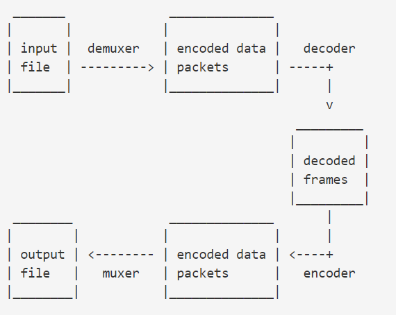

### 介绍

自动添加字幕

### 参考资料

- [axios-download-progress-in-node-js](https://futurestud.io/tutorials/axios-download-progress-in-node-js)

### 待实现功能

- 下载字幕
- videos 测试部分需要准备测试数据（测试数据也是测试的一部分，需要提交到 git 中，不然换设备之后测试就运行不过了）

### 视频基本概念

- container format
  avi,mp4 这种属于容器类型
- frame rate
  images per second
- bitrate
  bits per second
- frames
  数据单元
- packets
  压缩后的数据单元，一个 packets 可以包含多个完整的 frames
