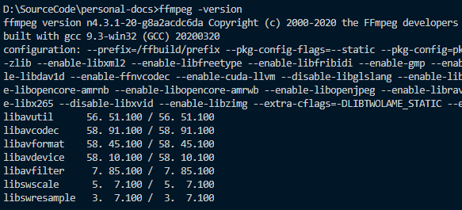
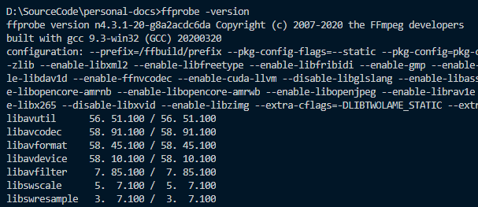

## Auto-add-subtitle

Auto parse subtitle for videos based on [ffmpeg](https://ffmpeg.org/download.html),[puppeteer](https://github.com/puppeteer/puppeteer) and [veed](https://www.veed.io/) (an excellent website)

Read this in other languages: [english](./README.md) | [简体中文](./README.zh-cn.md)

## Getting Started

### Installation

- install ffmpeg
  [ffmpeg](https://ffmpeg.org/download.html)

Make sure you can access `ffmpeg` and `ffprobe` like below.

```sh
ffmpeg -version
```



```sh
ffprobe -version
```



In windows, maybe you need restart your computer to make it works.

- install auto-add-subtitle

```sh
npm i -g auto-add-subtitle
```

Make sure you did not skip the installation of chromium.

### Usage

```sh
auto-add-subtitle [{path to you videos (default is current dir)}]
```


### Reference

- [axios-download-progress-in-node-js](https://futurestud.io/tutorials/axios-download-progress-in-node-js)
- [ffmpeg guide](https://gist.github.com/protrolium/e0dbd4bb0f1a396fcb55)
